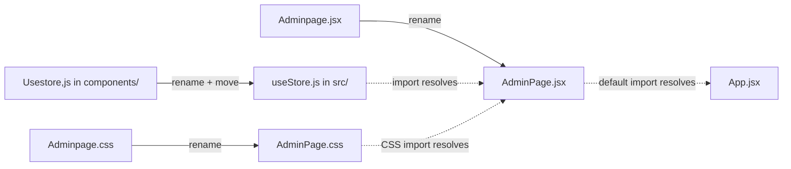

# Admin Page Fix Plan

## Issues Found

### 🔴 CRITICAL — App will not load the store

The Zustand/React store file has a **comma in the filename** instead of a period:

```
src/components/Usestore,js   ← comma makes it NOT a valid JS module
```

Both [`Adminpage.jsx`](it-outfit/src/components/Adminpage.jsx:2) and [`ShopPage.jsx`](it-outfit/src/components/ShopPage.jsx:8) import it as:

```js
import { useStore } from '../useStore';
```

The path `../useStore` resolves to `src/useStore.js`, but:
1. The file is inside `src/components/` (wrong directory)
2. The filename is `Usestore,js` (comma instead of period, wrong casing)

**Result**: The import always fails → the entire app crashes.

### 🟡 Case Mismatch — Works on Windows, breaks on Linux/macOS

| Import in code | Actual filename |
|---|---|
| `./components/AdminPage` in [`App.jsx`](it-outfit/src/App.jsx:7) | `Adminpage.jsx` |
| `./AdminPage.css` in [`Adminpage.jsx`](it-outfit/src/components/Adminpage.jsx:3) | `Adminpage.css` |

On Windows (case-insensitive) this resolves fine, but it's incorrect and would break on Mac/Linux deployments.

---

## Fix Steps

### Step 1 — Rename and move the store file
```
Rename:  src/components/Usestore,js  →  useStore.js
Move:    src/components/useStore.js  →  src/useStore.js
```
This matches the import path `../useStore` used by both Adminpage.jsx and ShopPage.jsx.

### Step 2 — Rename Adminpage.jsx → AdminPage.jsx
```
Rename:  src/components/Adminpage.jsx  →  AdminPage.jsx
```
Matches the import in App.jsx: `import AdminPage from './components/AdminPage'`.

### Step 3 — Rename Adminpage.css → AdminPage.css
```
Rename:  src/components/Adminpage.css  →  AdminPage.css
```
Matches the CSS import in AdminPage.jsx: `import './AdminPage.css'`.

### Step 4 — Verify the app runs
Run `npm run dev` and confirm:
- No console errors on startup
- Navigate to `/admin` — login screen renders
- Login with password works
- Dashboard, Products, and Categories views render correctly

---

## Summary Diagram


