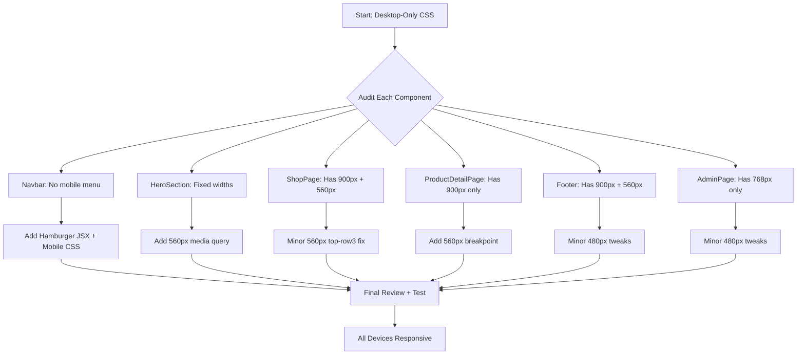

# Responsive Design Plan — IT Outfit

## Goal
Make the entire website fully responsive across all devices (mobile 320px → desktop 1440px+) **without changing the visual design**. Only add media queries and minimal structural JSX changes (hamburger menu).

## Breakpoint Strategy
| Breakpoint | Target | Already Used By |
|------------|--------|-----------------|
| 900px | Tablet landscape | ShopPage, Footer, PDP |
| 768px | Tablet portrait | AdminPage |
| 560px | Mobile | ShopPage, Footer |
| 480px | Small mobile | New — for very tight screens |

## Current Status

### Already Responsive
- [`Footer.css`](src/components/Footer.css) — 900px + 560px breakpoints
- [`ShopPage.css`](src/components/ShopPage.css) — 900px + 560px breakpoints
- [`Productdetailpage.css`](src/components/Productdetailpage.css) — 900px only
- [`AdminPage.css`](src/components/AdminPage.css) — 768px only

### NOT Responsive (Need Work)
- [`Navbar.css`](src/components/Navbar.css) — **CRITICAL: No media queries at all**
- [`HeroSection.css`](src/components/HeroSection.css) — No media queries
- [`ProductCard.css`](src/components/ProductCard.css) — No media queries (uses %, mostly OK)
- [`BottomCard.css`](src/components/BottomCard.css) — No media queries (uses %, mostly OK)
- [`Preloader.css`](src/components/Preloader.css) — No media queries (uses clamp(), OK)

---

## Task Breakdown

### 1. Navbar — Hamburger Menu + Mobile CSS
**Files:** [`Navbar.jsx`](src/components/Navbar.jsx) + [`Navbar.css`](src/components/Navbar.css)

**Problem:** Nav links use `gap: 28px` and will overflow on mobile. No hamburger menu exists.

**Changes:**
- **JSX:** Add a hamburger button (3-line icon) that toggles a mobile menu state
- **JSX:** When mobile menu is open, show nav links in a vertical dropdown overlay
- **CSS at 768px and below:**
  - Hide `.nav__links` by default on mobile
  - Show hamburger button (`.nav__hamburger`) only on mobile
  - Mobile menu: full-width dropdown from top, vertical links, theme swatches inline
  - Reduce navbar padding from `22px 36px` to `16px 16px`
  - Theme panel positions below navbar on mobile

### 2. HeroSection — Mobile Media Queries
**File:** [`HeroSection.css`](src/components/HeroSection.css)

**Problem:** Content uses `max-width: 52vw` and `padding: 0 5vw` which may not work well on small screens. `margin-top: 6rem` is too much for mobile.

**Changes at 560px:**
- `.hero__content` → `max-width: 85vw`, `padding: 0 4vw`, `margin-top: 4.5rem`
- `.hero__headline` → clamp already handles font size, but ensure `max-width` doesn't clip
- `.hero__sub` → `max-width: 100%`, reduce padding
- `.hero__brand` → reduce `left` to `4vw`, reduce font size slightly

### 3. ProductDetailPage — Small Screen Breakpoint
**File:** [`Productdetailpage.css`](src/components/Productdetailpage.css)

**Problem:** Only has 900px breakpoint. Missing smaller screen adjustments.

**Changes at 560px:**
- `.pdp__panel` → reduce padding to `32px 16px 48px`
- `.pdp__name` → reduce font size to `1.8rem`
- `.pdp__back` → reduce `margin-bottom` to `32px`
- `.pdp__desc` → remove `max-width: 380px` constraint
- `.pdp__add` → full width button

### 4. ShopPage — Minor 560px Tweaks
**File:** [`ShopPage.css`](src/components/ShopPage.css)

**Problem:** `top-row3` still shows 2 columns at 560px which may be tight.

**Changes at 560px:**
- `.top-row3` → `grid-template-columns: 1fr` (single column on very small screens)
- `.top-row3 .pcard:nth-child(2) .pcard__wrap` → `aspect-ratio: 3/4`
- Reduce `.shop__sec` padding-bottom if needed

### 5. Footer — Minor 480px Tweaks
**File:** [`Footer.css`](src/components/Footer.css)

**Changes at 480px:**
- `.footer__tagline` → clamp handles it, but reduce padding further
- `.footer__badge-symbol` and `.footer__badge-year` → smaller sizes
- `.footer__shop-grid` → single column

### 6. AdminPage — Minor Small Screen Tweaks
**File:** [`AdminPage.css`](src/components/AdminPage.css)

**Changes at 480px:**
- `.adm-view` → reduce padding to `1rem`
- `.adm-view__title` → reduce font size
- `.adm-stats` → already 1 column at 768px, verify it works at 480px
- `.adm-panel` → already `width: 100vw` at 768px, OK
- `.adm-login__box` → reduce padding on small screens

### 7. index.css — Viewport Meta (Verify)
**File:** Check [`index.html`](index.html) for viewport meta tag. Must have:
```html
<meta name="viewport" content="width=device-width, initial-scale=1.0">
```

---

## Mermaid Flow — Responsive Strategy



## Files Modified Summary

| File | Type of Change |
|------|---------------|
| `Navbar.jsx` | Add hamburger button + mobile menu state |
| `Navbar.css` | Add 768px + 560px media queries |
| `HeroSection.css` | Add 560px media query |
| `Productdetailpage.css` | Add 560px media query |
| `ShopPage.css` | Minor 560px tweaks |
| `Footer.css` | Minor 480px tweaks |
| `AdminPage.css` | Minor 480px tweaks |
| `index.html` | Verify viewport meta tag |
